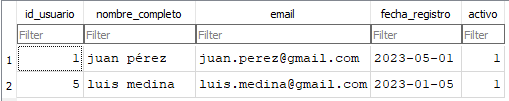

# 🛢️ Proyecto ETL desde Base de Datos Cruda | Raw Database ETL Project

Este proyecto implementa un pipeline ETL en Python que parte desde una base de datos SQLite sucia (`usuarios_raw.db`), limpia los datos usando pandas y los carga en una base limpia (`usuarios.db`) lista para análisis.

This project implements a Python-based ETL pipeline starting from a raw SQLite database (`usuarios_raw.db`), cleans it using pandas, and loads the cleaned data into `usuarios.db` for analysis.

---

## 🔧 Tecnologías utilizadas | Technologies used

- Python 3  
- pandas  
- sqlite3  
- SQLAlchemy  
- DB Browser for SQLite

---

## 🧪 ¿Qué hace este pipeline? | What does this pipeline do?

✔️ Limpia nombres (espacios, minúsculas)  
✔️ Valida emails  
✔️ Normaliza fechas  
✔️ Convierte campos como “sí”, “NO”, “false” a 1 o 0  
✔️ Elimina registros con emails o fechas inválidas  
✔️ Carga los datos en una nueva tabla `usuarios_limpios`

---

## 📂 Estructura del proyecto | Project structure


---

## ▶️ Cómo ejecutar | How to run

```bash
python etl_usuarios_desde_raw.py
SELECT COUNT(*) FROM usuarios_limpios WHERE activo = 1;

---

## 🚀 ¿Y después de pegarlo?

1. **Guardá el archivo**
2. En tu terminal de Visual Studio Code:

```bash
git add README.md
git commit -m "README final funcional con vista previa"
git push origin master
## Vista previa de los datos limpios



